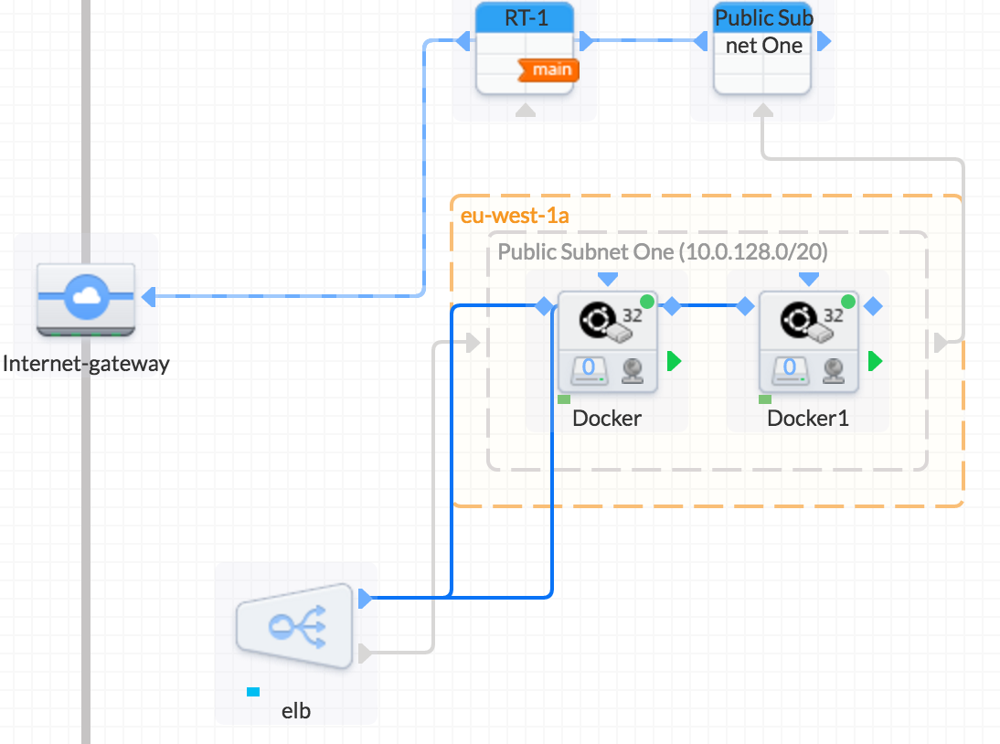

# terraform-aws-route53

This attempts to demonstrate hosted zones with route53

Currently the example uses `eu-west-1` but if you want to change this just adjust the `aws_instance` and their ami ids.

To use this you'll need to generate `keys/ami_keys (private) and keys/ami_keys.pub`
```
# replace route53.tf with your domain
ssh-keygen #Generate a keypair in `./keys`
ssh-add -K keys/ami_keys
terraform apply
Visit your domain to see route53 now pointing to the deployed load balancer and instances
```


